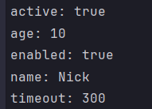

<h1 align="center"> Configuration language  </h1>
This is a command line tool for the tutorial configuration language, the syntax of which is given below. This tool converts text from the input format to the output format. Syntax errors are detected and messages are issued. The input text in the tutorial configuration language is taken from a file with the extension .txt. The output text in the yaml language is written to the standard output.

# 📘 Installation and running

```commandline
git clone https://github.com/Nikindrik/Configuration-language
python -m venv venv
```
For windows
```commandline
.\venv\Scripts\activate
pip install pyyaml
```
For linux/UNIX/MAC
```commandline
source venv/bin/activate
pip install pyyaml
```
Run
```commandline
python main.py <input.txt> <package_name> <output.yaml>   
```
Example 
```editorconfig
python main.py 1.txt output.yaml
```

# 💻 The command line switches are set:

* **Input <name.txt> file**
* **Output <name.yaml> file**

# 🖼️ Results Gallery




# 📚 Sintaxis of Configuration language

```
Однострочные комментарии:
\ Это однострочный комментарий
Многострочные комментарии:
<!--
Это многострочный
комментарий
-->
Массивы:
{ значение. значение. значение. ... }
Словари:
([
 имя : значение,
 имя : значение,
 имя : значение,
 ...
])
Имена:
[_a-zA-Z][_a-zA-Z0-9]*
Значения:
• Числа.
• Строки.
• Массивы.
• Словари.
Строки:
@"Это строка"
Объявление константы на этапе трансляции:
имя := значение
Вычисление константы на этапе трансляции:
!(имя)
```